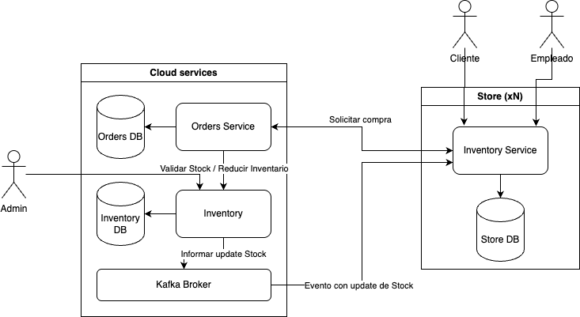
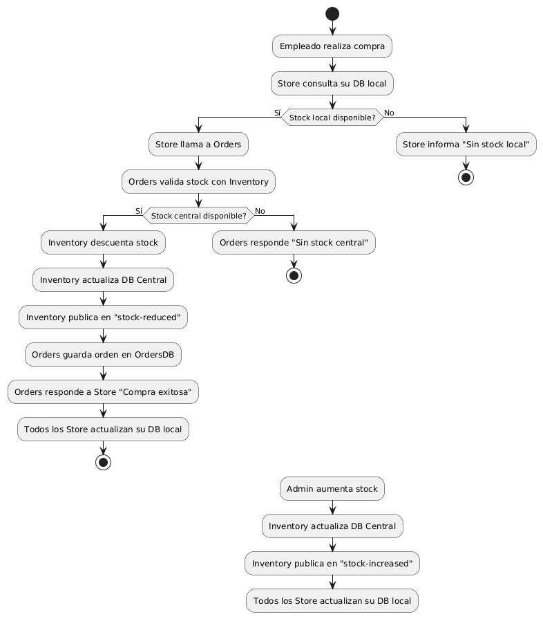
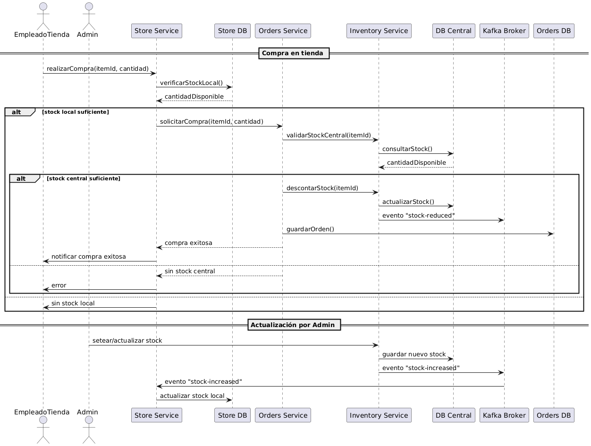

# 📦 Sistema Distribuido de Gestión de Inventario

## 1. Introducción

Este documento describe el diseño e implementación de un sistema distribuido de gestión de inventario para una cadena de tiendas minoristas. El objetivo principal es optimizar la **consistencia del inventario**, reducir la **latencia en las actualizaciones de stock**, disminuir los **costos operativos** y asegurar la **seguridad** y **observabilidad** del sistema.

Se realizó mediante una arquitectura de microservicios basada en **Java (Spring WebFlux)**, con uso intensivo de eventos mediante **Apache Kafka**.

---

## 2. Arquitectura General del Sistema

El sistema se compone de los siguientes microservicios:

- **Inventory Service (centralizado)**: administra el inventario global y publica eventos Kafka.
- **Order Service (centralizado)**: gestiona el flujo de órdenes y se comunica con Inventory.
- **Store Service (por tienda)**: mantiene una réplica local del inventario y permite realizar compras.
- **Auth Service (centralizado)**: mínima implementación de registro de usuario, para demostración de funcionalidad de JWT.

Kafka maneja los siguientes tópicos:

- `new-category`
- `new-inventory`
- `inventory-updated`

---

## 3. Funcionamiento del Sistema

### 3.1 Sincronización del Inventario

Cada tienda cuenta con un servicio local que actúa como consumer de los tópicos de Kafka: **new-category**, **new-product** e **inventory-updated**. Estos tópicos permiten que la base de datos local en cada tienda se mantenga actualizada en tiempo real con los cambios realizados desde el inventario centralizado.
Cuando se registra una nueva categoría o un nuevo producto desde el Inventory Service, se publica un evento en Kafka que las tiendas consumen para insertar los datos correspondientes en su base local.
Cuando se realiza una compra, el Inventory Service actualiza el stock global y emite uno o varios eventos en el tópico **inventory-updated**, indicando el nuevo estado del inventario.
Cada Store Service, al estar suscrito a estos tópicos, captura estos eventos y actualiza inmediatamente su base de datos local, manteniéndola sincronizada con el estado central.
Este mecanismo elimina la necesidad de procesos periódicos de sincronización (que antes se realizaban cada 15 minutos) y permite una arquitectura event-driven, más eficiente, resiliente y en tiempo casi real. De esta forma, se logra una consistencia eventual con muy baja latencia, lo cual es clave para evitar ventas de productos sin stock o inconsistencias de disponibilidad.
La sincronización inmediata del stock permite que los usuarios y clientes finales consulten disponibilidad con una mayor confiabilidad, mejorando significativamente la experiencia de usuario.

### 3.2 Flujo de Compra

1. Store valida stock local.
2. Solicita orden a Order Service.
3. Order valida con Inventory y reserva stock.
4. Inventory publica evento `inventory-updated`.
5. Order persiste orden.
6. Store puede consultar el historial de órdenes.

---

## 4. Decisiones Arquitectónicas

| Elemento                       | Justificación                                                 |
| ------------------------------ | ------------------------------------------------------------- |
| **Microservicios**             | Separación de responsabilidades, escalabilidad independiente. |
| **Kafka**                      | Comunicación asíncrona y sincronización en tiempo real.       |
| **Bases locales**              | Alta disponibilidad y operación offline temporal.             |
| **WebFlux**                    | Asincronía eficiente y manejo reactivo.                       |
| **Retry en fachadas**          | Mayor tolerancia a fallos.                                    |
| **Excepciones personalizadas** | Mejor trazabilidad de errores.                                |
| **JWT básico**                 | Simulación de seguridad y autenticación.                      |
| **Pods redundantes**           | Alta disponibilidad en Inventory y Orders.                    |

---

## 5. Requisitos No Funcionales Cumplidos

| Categoría               | Implementación                                                 |
| ----------------------- | -------------------------------------------------------------- |
| **Consistencia**        | Confirmación en Inventory antes de cerrar orden.               |
| **Baja latencia**       | Consumo en tiempo real de eventos Kafka.                       |
| **Observabilidad**      | Excepciones con códigos personalizados y logging estructurado. |
| **Tolerancia a fallos** | Retry en llamadas entre microservicios.                        |
| **Seguridad**           | JWT básico simulado.                                           |
| **Escalabilidad**       | Servicios desacoplados y replicables.                          |
| **Documentación**       | Diagramas UML, README y estructura clara.                      |

---

## 6. Stack Tecnológico

- Java 21
- Spring WebFlux
- Apache Kafka
- MySQL
- Maven
- JWT (básico)
- Redis (futuro)
- GenAI

## 8. Conclusión y Propuestas Futuras

El sistema cumple con los objetivos propuestos y mejora significativamente la operación del inventario distribuido. La transición desde una arquitectura monolítica hacia un modelo de microservicios permitió resolver problemas estructurales del sistema anterior, como la latencia en las actualizaciones, las inconsistencias de stock, y la baja tolerancia a fallos.

Mediante el uso de Kafka como sistema de mensajería y la implementación de un modelo event-driven, se logró una sincronización casi en tiempo real entre el inventario central y las tiendas locales, sin necesidad de sincronización periódica. Esto garantiza una experiencia de usuario más confiable y mejora los indicadores de disponibilidad de producto.

La adopción de Spring WebFlux y programación reactiva permitió una gestión más eficiente de recursos y una alta capacidad de concurrencia, mientras que las fachadas con retry automático y las excepciones personalizadas aportaron robustez y trazabilidad al sistema.

Asimismo, se establecieron las bases para una futura expansión del sistema con características como seguridad avanzada (OAuth2), monitorización distribuida (Grafana/Prometheus) y despliegue escalable (Kubernetes). El diseño modular y desacoplado asegura que cada componente pueda evolucionar o escalar independientemente, favoreciendo la mantenibilidad y la innovación continua.

### Futuras mejoras:

- Trazabilidad distribuida (Micrometer + Grafana)
- OAuth2 y control de acceso avanzado
- Orquestación con Kubernetes
- Modo offline y re-sincronización
